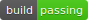
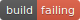

# nikitas-badges
some badges I made to be used with local-badges

## buildStatus

### Usage:

```js
// your badgeConfig.js file
const { buildStatus } = require('nikitas-badges')
module.exports = {
  badges: [
    buildStatus,
    {
      // any other badges you might want to include
    },
  ],
  defaults: {
    template: 'plastic',
  },
}
```

outputs badge named 'build-status.svg' into the current working directory.
To modify this behavior, you can do something like:

```js
const { buildStatus } = require('nikitas-badges')
const customBuildStatus = {
  ...buildStatus,
  name: 'i-want-my-badge-to-be-named-differently',
  folder: './i/want/my/badge/to/go/to/a/different/folder',
}
module.exports = {
  badges: [
    customBuildStatus,
  ],
  defaults: {
    template: 'plastic',
  },
}
```

### Examples:

[](./examples/buildStatus/passing.svg)

[](./examples/buildStatus/failing.svg)

### Cli args:

Depends on the `--build-status` argument being passed in to local-badges. Including `--build-status SUCCESS` will create a build passing badge in bright green, otherwise it outputs build failing in red.
